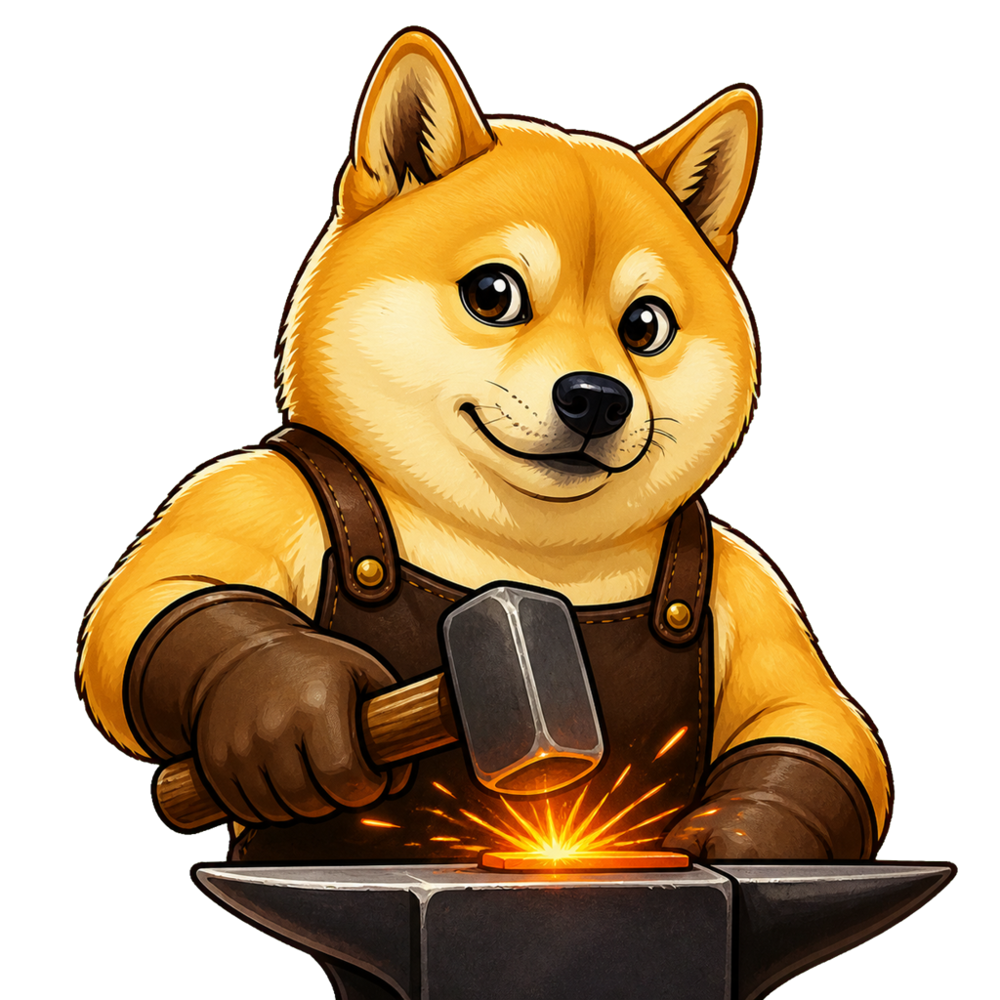
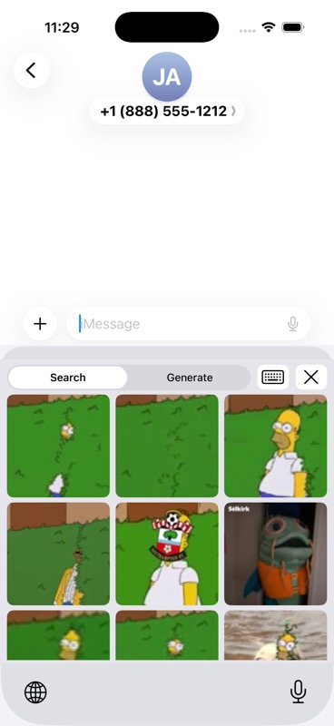
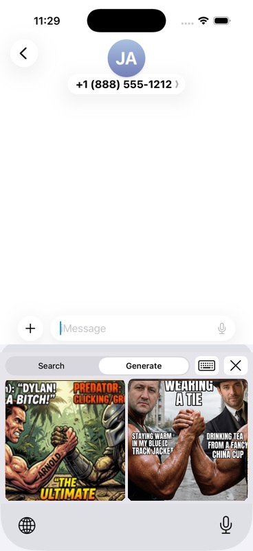
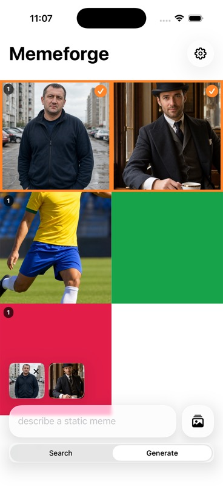
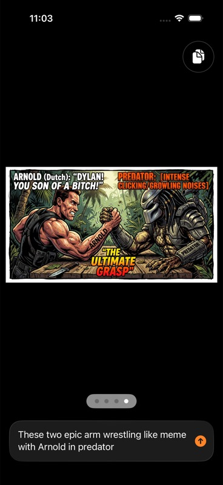

<p align="center">
	
</p>

<h1 align="center">Memeforge</h1>

<p align="center">An iOS keyboard for searching GIF memes and generating static memes from prompts.</p>

## Setup

`Config/LocalSecrets.xcconfig` is required. Xcode will fail before building if it is missing, and the build also fails if either resolved key is blank.

Generate it from env-manager:

```sh
env-manager down
```

If you are not using env-manager, create `Config/LocalSecrets.xcconfig` yourself:

```xcconfig
GIPHY_API_KEY = your-giphy-api-key
GEMINI_API_KEY = your-gemini-api-key
```

For Xcode Cloud, add `GIPHY_API_KEY` and `GEMINI_API_KEY` as workflow environment variables or secrets. The committed `ci_scripts/ci_post_clone.sh` script writes `Config/LocalSecrets.xcconfig` before Xcode Cloud starts `xcodebuild`.

`Config/LocalSecrets.xcconfig` is ignored by git. Normal Xcode build phases cannot generate it once the required `.xcconfig` include is missing, because build settings are resolved before build phases run.

Open `Memeforge.xcodeproj`, build the `Memeforge` scheme, then enable the keyboard in iOS Settings:

```text
General > Keyboard > Keyboards > Memeforge > Allow Full Access
```

Full Access is required so the keyboard extension can call the GIPHY and Gemini APIs.

## Run

Start the simulator, build, install, and launch the app:

```sh
./start
```

Pass a simulator name to use a different device:

```sh
./start "iPhone 17 Pro"
```

Native iOS apps do not have React-style hot reload. After Swift or asset changes, rerun the script or build/run again from Xcode to rebuild, reinstall, and relaunch. SwiftUI previews are the closest fast feedback loop for isolated UI work, but they do not replace the running app in Simulator.

## Screenshots

| Keyboard search in Messages: `disappear homer` | Keyboard generate in Messages: `these two epic arm wrestling like meme with Arnold in predator` |
| --- | --- |
|  |  |

| App collection: three source photos, two selected | App generate: `these two epic arm wrestling like meme with Arnold in predator` |
| --- | --- |
|  |  |
